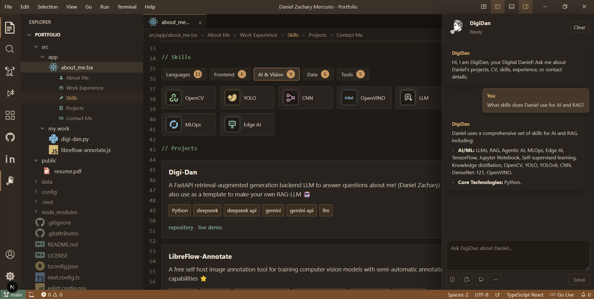
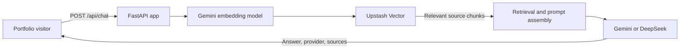
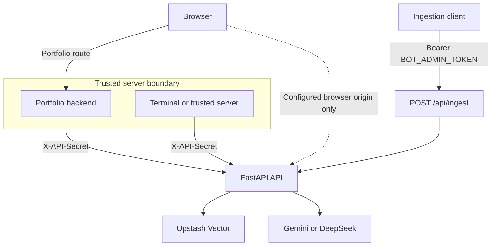

# Digi-Dan

<p align="left">A retrieval-augmented generation backend for a grounded portfolio assistant.</p>

<p align="left">
  
  
  
  
  
</p>

<p align="center">
  
</p>

## Navigate

[What it does](#what-it-does) · [UI example](#ui-example) · [Architecture](#architecture) · [Quick start](#local-setup) · [API](#api-reference) · [Operations](#operations) · [Security](#security-and-troubleshooting) · [Documentation](#documentation)

## What it does

Digi-Dan stores curated portfolio facts in Upstash Vector, retrieves the most relevant chunks for each question, and uses Gemini or DeepSeek to generate a grounded answer with source records. It runs locally with Uvicorn and deploys as a FastAPI backend on Vercel.

Portfolio information is useful only when visitors can find it. Digi-Dan turns approved profile, education, project, skill, and experience data into answerable context: retrieve facts first, generate a response second, and return the sources used for transparent review and debugging.

It can also be adapted into a resume bot, documentation assistant, or small knowledge-base chatbot.

| Area | What the project demonstrates |
| --- | --- |
| Grounding | Gemini embeddings retrieve relevant Upstash Vector chunks before generation. |
| Responses | Gemini or DeepSeek generation returns an answer, provider, and source records. |
| Operations | JSON, JSONL, and TXT ingestion through a CLI or Bearer-protected API. |
| Safety | Origin allowlists, a trusted server bypass, protected ingestion, and chat rate limiting. |
| Deployment | Uvicorn development, Vercel-compatible ASGI entrypoint, and automated RAG-data uploads. |

[TODO: public demo — add a verified public URL and short access instructions when one is available.]

## UI example

The chat interface below is an example of the portfolio-facing experience. A visitor asks a question while Digi-Dan retrieves relevant context and returns a response with the source records used to ground it.



## Architecture

### RAG request flow



### Deployment and trust boundaries



Important files:

```txt
app.py                                  Vercel/Uvicorn ASGI entrypoint
api/endpoint/application.py             FastAPI app, middleware, routes
api/core/config.py                      Environment variable loading
api/core/models.py                      Request and response models
api/core/prompts.py                     Default system prompt
api/query/rag.py                        Retrieval and prompt assembly
api/query/providers.py                  Gemini, DeepSeek, and embedding calls
api/tools/vector_store.py               Upstash Vector query/upsert helpers
api/tools/upload_vectorstore.py         CLI uploader for RAG data
daniel-zachary-rag-data.json            Template knowledge base
.github/workflows/upload-rag-data.yml   Automatic vector upload workflow
```

## Local setup

Copy `.env.example` to `.env` (`Copy-Item .env.example .env` on PowerShell). Keep it as plain `KEY=value` lines only.

```powershell
python -m venv .venv
.\.venv\Scripts\Activate.ps1
python -m pip install -r requirements.txt
uvicorn app:app --reload --port 8001
```

On macOS/Linux, activate with `source .venv/bin/activate`. Test health with:

```powershell
Invoke-RestMethod -Uri "http://127.0.0.1:8001/api/health" -Headers @{ "X-API-Secret" = "YOUR_API_BYPASS_SECRET" }
```

## API reference

### `GET /`

Basic root check:

```json
{ "name": "Digi-Dan", "status": "ok" }
```

### `GET /api/health`

Health check for local, Vercel, or uptime monitoring. Protected by the same origin/bypass middleware as other `/api/*` routes.

### `POST /api/chat`

```json
{
  "message": "Where did Daniel get his college education?",
  "provider": "gemini",
  "top_k": 4,
  "namespace": "digi-dan-rag"
}
```

`message` is required. `provider` is `gemini` or `deepseek` and defaults to `DEFAULT_PROVIDER`; `system`, `top_k`, and `namespace` are optional.

```json
{
  "answer": "Daniel studied at President Ramon Magsaysay State University...",
  "provider": "gemini",
  "sources": [{ "id": "education-college", "score": 0.8238814, "text": "Daniel's college education...", "metadata": { "section": "education", "topic": "college" } }]
}
```

### `POST /api/ingest`

Upload documents into Upstash Vector through the API. It requires `Authorization: Bearer BOT_ADMIN_TOKEN`.

```json
{ "namespace": "digi-dan-rag", "documents": [{ "id": "education-college", "text": "Daniel studied Computer Engineering...", "metadata": { "section": "education" } }] }
```

## Configuration

| Variable | Purpose |
| --- | --- |
| `APP_NAME` | API display name. |
| `CORS_ORIGINS`, `ALLOWED_ORIGIN_DOMAINS` | Browser CORS and custom-origin allowlists. |
| `API_BYPASS_SECRET` | Trusted terminal/server `X-API-Secret`; never expose it in browser code. |
| `GEMINI_API_KEY`, `GEMINI_MODEL`, `GEMINI_EMBEDDING_MODEL` | Gemini embeddings and generation settings. |
| `EMBEDDING_DIMENSIONS` | Must match the Upstash Vector index dimension; default `768`. |
| `DEEPSEEK_API_KEY`, `DEEPSEEK_BASE_URL`, `DEEPSEEK_MODEL` | DeepSeek generation settings. |
| `UPSTASH_VECTOR_REST_URL`, `UPSTASH_VECTOR_REST_TOKEN`, `UPSTASH_NAMESPACE` | Vector connection and namespace. |
| `BOT_ADMIN_TOKEN` | Ingest-route Bearer token. |
| `DEFAULT_PROVIDER`, `RETRIEVAL_TOP_K`, `MAX_CONTEXT_CHARS` | Generation and retrieval defaults. |
| `CHAT_RATE_LIMIT`, `CHAT_RATE_LIMIT_WINDOW_SECONDS` | Per-client chat limiting; use `0` to disable the limit. |

## Operations

### RAG data and upload

The included data file uses a `documents` array of objects with stable `id`, focused `text`, and optional `metadata`. Keep likely user wording near the start of each chunk, and add summary chunks for broad questions.

```bash
python -m api.tools.upload_vectorstore daniel-zachary-rag-data.json --namespace digi-dan-rag
```

The uploader supports `.json` (`{"documents": [...]}` or a raw document array), `.jsonl` (one document object per line), and `.txt` (one document).

### GitHub Actions RAG upload

`.github/workflows/upload-rag-data.yml` runs when RAG data or ingestion code changes on `main`. Configure `GEMINI_API_KEY`, `UPSTASH_VECTOR_REST_URL`, and `UPSTASH_VECTOR_REST_TOKEN` as repository secrets. Optional variables are `UPSTASH_NAMESPACE`, `GEMINI_EMBEDDING_MODEL`, and `EMBEDDING_DIMENSIONS`. The workflow can also run manually.

### Vercel deployment

The root `app.py` exposes the ASGI app. Use Vercel's **FastAPI** preset, repository root, and default/empty build, install, and output settings. Add the same production configuration values; `DEEPSEEK_API_KEY` is needed only when DeepSeek generation is enabled.

### Using it from a portfolio

Proxy browser requests through the portfolio backend and attach `X-API-Secret` only there. Browser code should call the portfolio route, not send that secret. Direct browser calls are appropriate only if the site domain is configured in both origin settings.

### Using this as a template

1. Fork or copy the repository.
2. Rename `APP_NAME`, replace `daniel-zachary-rag-data.json`, and update `api/core/prompts.py`.
3. Create an Upstash Vector index matching `EMBEDDING_DIMENSIONS`.
4. Set local, Vercel, and GitHub Actions environment variables.
5. Upload the knowledge base and connect a trusted frontend/server route to `POST /api/chat`.

## Security and troubleshooting

- Do not commit `.env`, expose `API_BYPASS_SECRET` or `BOT_ADMIN_TOKEN`, or make `/api/ingest` a public browser operation.
- `Forbidden origin`: use the bypass secret for terminal/server calls, or configure the browser origin.
- `GEMINI_API_KEY is not configured`: Gemini is needed for embeddings even when DeepSeek generates the answer.
- Unexpected answers: inspect `sources`, improve chunks, add summaries, increase `top_k`, and re-upload.
- Vercel unmatched function pattern: use the FastAPI preset and root `app.py`; do not add stale function patterns.

## Documentation

- [Documentation home](docs/index.md)
- [Architecture and trust boundaries](docs/architecture.md)
- [Knowledge-base example](daniel-zachary-rag-data.json)
- [Portfolio showcase metadata](portfolio-showcase.json)

## License

See [LICENSE](LICENSE).
