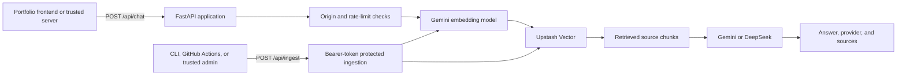

# Architecture

Digi-Dan is a small FastAPI service that combines vector retrieval with a selected text-generation provider. It is designed for a portfolio frontend or another trusted server to call rather than for browser code to hold privileged credentials.

## Request path

1. A caller sends a message to `POST /api/chat`, optionally selecting a generation provider, result count, and Upstash namespace.
2. The service applies origin rules and per-client rate limiting.
3. Gemini embeds the message. Upstash Vector returns the relevant chunks for that embedding.
4. Digi-Dan builds a grounded prompt from those chunks and calls Gemini or DeepSeek for generation.
5. The API returns the answer, the provider used, and source records containing chunk identifiers, scores, text, and metadata.

Even when DeepSeek is selected for generation, Gemini remains necessary for the embedding path.

## Components

| Component | Responsibility |
| --- | --- |
| `app.py` | Imports and exposes the FastAPI application for Uvicorn and Vercel. |
| `api/endpoint/application.py` | Defines the root, health, chat, and ingest routes; registers CORS and origin middleware. |
| `api/query/rag.py` | Coordinates retrieval, prompt assembly, answer creation, and ingestion. |
| `api/query/providers.py` | Calls Gemini embeddings plus Gemini or DeepSeek generation. |
| `api/tools/vector_store.py` | Queries and upserts data in Upstash Vector. |
| `api/tools/security.py` | Applies origin/bypass handling, admin-token checks, and chat rate limiting. |
| `api/tools/upload_vectorstore.py` | Loads JSON, JSONL, or text files for vector ingestion. |

## Trust boundaries

- Browser traffic is allowed only from configured origins. Do not add permissive production origins without considering who can invoke the chat API.
- `X-API-Secret` is a trusted server or terminal bypass. It must never be sent from browser JavaScript.
- `POST /api/ingest` requires `Authorization: Bearer BOT_ADMIN_TOKEN`; treat it as an administrative operation.
- Gemini, DeepSeek, and Upstash credentials stay in local, deployment, and automation environment variables rather than the repository.

## Deployment and data operations

The root ASGI entrypoint supports local Uvicorn development and Vercel's FastAPI deployment flow. The included GitHub Actions workflow can upload the RAG data after relevant changes on `main`; it needs the Gemini and Upstash repository secrets described in the [README](../README.md#github-actions-rag-upload).

The vector index dimension must match `EMBEDDING_DIMENSIONS`. Keep each knowledge-base document focused, use stable IDs, include useful metadata, and add summary chunks for broad questions. See the [README's RAG data and upload section](../README.md#rag-data-and-upload) for examples and upload commands.

[TODO: Add a deployment diagram, supported environment matrix, or observability runbook if the project gains those operational requirements.]
